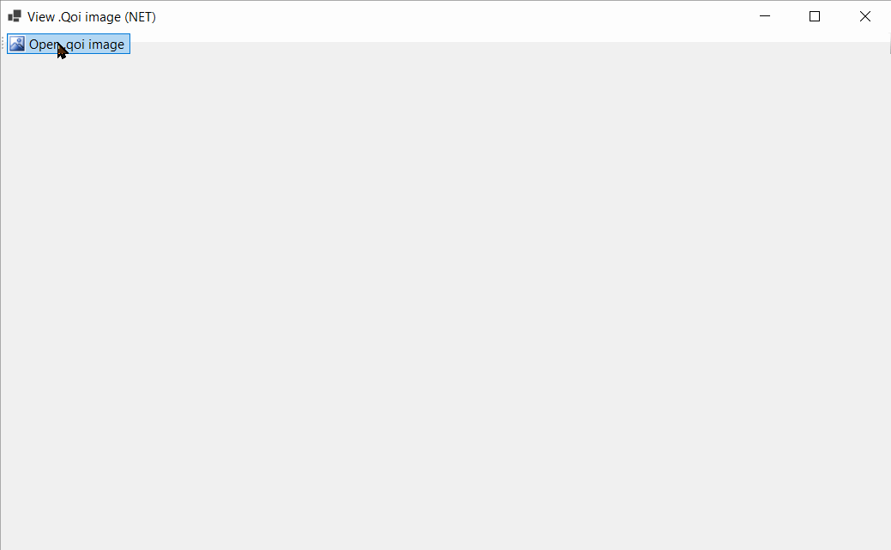

This is a very basic .qoi image viewer implemented in .NET. It uses the Qoi.NetStandard library, added as a NuGet package to the project.

<div align="center">



</div>

Although this is a NET example, the exact same code can be used on .Net Framework, .Net Core, Monoo or Xamarin (iOS and Android).
<br/><br/>

# Points of interest
## Open an OpenFileDialog and browse for a .Qoi image
```csharp
// This is just standard System.Windows.Forms code!
DialogResult dr = ofdOpenQoiImage.ShowDialog();
if (dr != DialogResult.OK)
    return;

// Once we have the file name, decode it and show
// the image in a PictureBox
string fileName = ofdOpenQoiImage.FileName;
pictureBox1.BackgroundImage = DecodeQoi(fileName);
```
<br/>

## Decode the .Qoi image using Qoi.NetStandard
```csharp
// This is the only line of code that actually has to
// use Qoi.NEtStandard!
//
// Use DecodeQoi from Qoi.NetStandard library
byte[] colorBytes = Qoi.NetStandard.QoiEncoder.DecodeQoi(fileName, out Qoi.NetStandard.QoiHeader header);
```
<br/>

## Create an Image object from the decoded bytes:
```csharp
// This is just standard System.Drawing.Imaging code!
//
// 1) Create a bitmap object
PixelFormat pixelFormat = header.Channels == 3 ? PixelFormat.Format24bppRgb : PixelFormat.Format32bppArgb;
Bitmap bitmap = new Bitmap((int) header.Width, (int) header.Height, pixelFormat);
// 2) Copy the pixel data
// We could set each pixel using [bitmap.SetPixel]
// but bulk-setting all bytes is more efficient
BitmapData bitmapData = bitmap.LockBits(new Rectangle(new Point(0, 0), bitmap.Size), ImageLockMode.ReadWrite, bitmap.PixelFormat);
IntPtr iptr = bitmapData.Scan0;
System.Runtime.InteropServices.Marshal.Copy(colorBytes, 0, iptr, colorBytes.Length);
bitmap.UnlockBits(bitmapData);
```